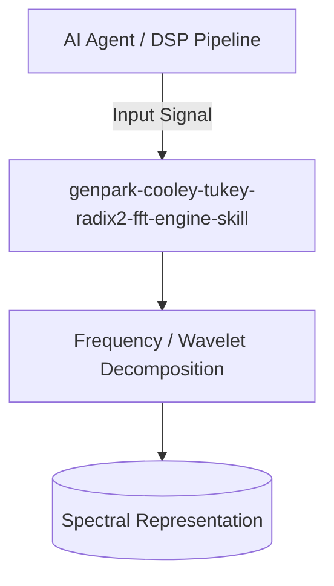

# genpark-cooley-tukey-radix2-fft-engine-skill

[](https://github.com/alphaparkinc/genpark-cooley-tukey-radix2-fft-engine-skill/actions)
[](https://opensource.org/licenses/MIT)
[](https://www.python.org/downloads/)

> Cooley-Tukey Radix-2 Fast Fourier Transform (FFT) and Inverse FFT (IFFT) engine providing O(N log N) frequency domain decomposition.

## Architecture



## Features
- Pure standard library Python implementation with strictly zero pip dependencies.
- Mathematically rigorous implementations of Fourier, Wavelet, Cosine, and Hilbert transforms.
- Native Model Context Protocol (MCP) server support for AI agent signal analysis.

## Installation

```bash
git clone https://github.com/alphaparkinc/genpark-cooley-tukey-radix2-fft-engine-skill.git
cd genpark-cooley-tukey-radix2-fft-engine-skill
```

## Quickstart

```bash
python example_usage.py
```
